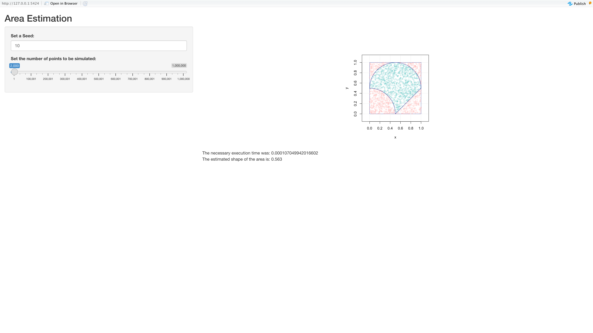

###  This is the library `pkghw4g1` and it contains the following two functions :
1. **estimate_area()** to estimate the area 
2. **plot_area()** to plot the results
```{r, warning = FALSE}
library(pkghw4g1)
x <- estimate_area(B = 2000, seed = 10)
plot_area(x)

```

###  This is the shiny application that allows to simulate different points and plot them
{width=150%}

